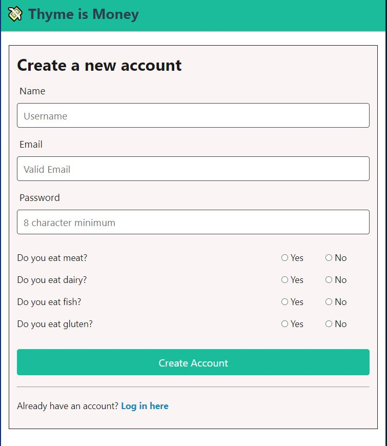
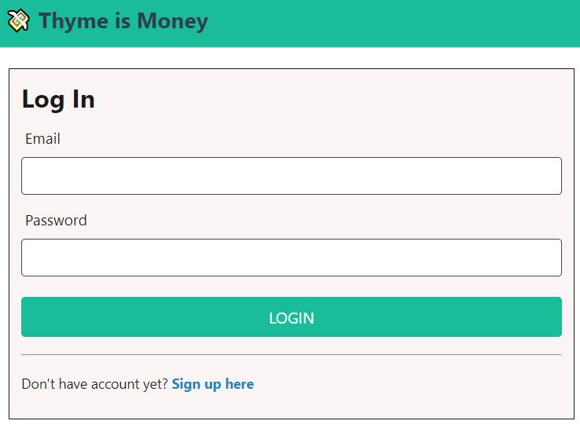

# Thyme is Money - Project 2

Thyme is Money is an application that helps the user to solve the age-old question, “What do I want for dinner”. After initially creating an account on the application, the user is prompted to input their dietary preferences. Using those preferences, our application will prompt the user to input their preferred cuisine that day, as well as ingredients on hand, and generate a recipe for a dish that they can prepare for dinner. 

## Table of Contents
  - [Installation](#installation)
  - [Usage](#usage)
  - [Credits](#credits)
  - [License](#license)

# Installation
  In order to run this code, the user must have node installed on their device, as well as mySQL.
* Make a copy of `.env_example` file
* Rename copied file to `.env` and update it with your MySQL Workbench password
* Copy sql command from `schema.sql` and run it in MySQL Workbench 
* Run following commands from your project root directory\
    ``npm install``\
    ``npm run seed``\
    ``npm start``

## Contributers
  Tiffany Deakin, Jason Hsieh, Alap Raval, and Heidi Reyes

## Usage
  In order to use this application, the user must simply create an account on our login page, and then input their dietary preferences of whether or not they eat meat, dairy, fish, and gluten. Once they've made and account and any subsequent time they log in, they will then be prompted through a short survey, which upon completion will display a random recipe that fits their criteria. 

## Credits
  The team members of this project extend our thanks to Scott Brunswig, Katy Cooney, and Nicole Wilsey Starr for their assistance and guidance through the development process. 

## License
  Licensed under the MIT license

